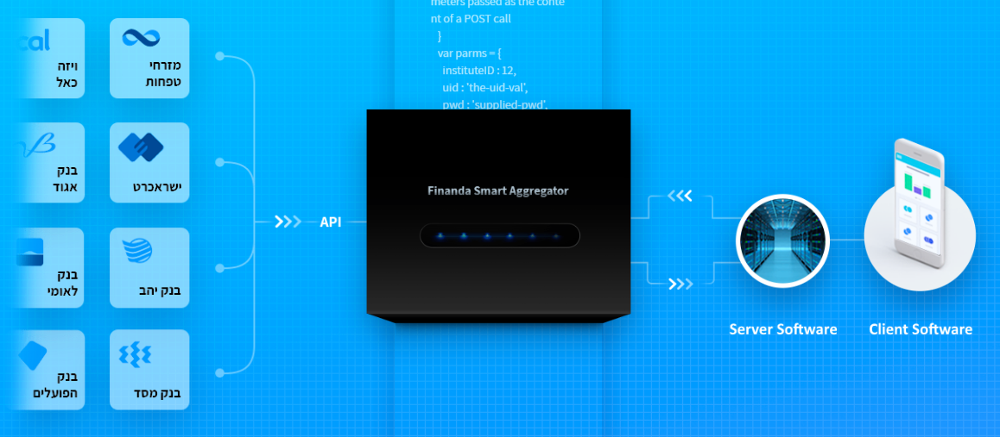

# Finanda Smart Aggregation Reference Project

This Reference Project demonstrates how to use the Finanda Smart Aggregation API.

## Introduction
### Terminology
* FSA - Acronym for Finanda Smart Aggregation
* Customer - an entity that uses FSA API
* End user - a client of the entity that uses some app provided by the entity 
* Server Software - Software provided by the entity to service their users, this software uses the FSA API internally for some of the services it exposes to the end-users.
* Client Software - Software provided by the entity that runs on a end-user’s machine, it provides the user-interface to the services the entity provides.



### Technology used
* Server Software - The reference project uses Node.JS and the Express library to service HTTP/HTTPS requests from the user interface. Clearly any technology that can perform standard HTTPS requests can be used to connect to the FSA API - be it Java, PHP or any other applicable technology.
* Client Software - The reference project uses standard HTML, CSS and Javascript using the jQuery library . Clearly, any software that can connect to a service provider can be used for this task - be it a native Windows or Mac software, Mobile or any Web technology.

### Workflow
The End-user interface (enduser-frontend) is implemented using a basic html form. Download credentials are collected and sent to the Customer’s server (server-backend).

server.js implements a simple http server (using Express), requests from the end-user are processed and the appropriate API calls are used. For example, the credentials parameters (user id, password etc..) are signed using the customer-id and customer-secret-key and sent to the FSA API calls to initiate jobs against the selected financial institute.

The code demonstrates how to check for job results - checking for download job progress, finding out if the job succeeded and how to retrieve and handle the results (e.g. - storing to a database or sending the results back to the end-user).

## Getting Started

### Quickstart
Prerequisite - NodeJS version 6 or above and NPM are installed on the machine.
1. Register to Finanda Smart Aggregation API at https://www.finanda.com/api/registration/ 
and get your customer information: `CUSTOMER_ID` and `CUSTOMER_SECRET_KEY`
2. Download or clone this repository to your local machine, assuming on `project-path`.
3. Open `project-path/server-backend/server.js` and look for `TODO_FILL_CUSTOMER_ID` and `TODO_FILL_SECRET_KEY`.
Change accordingly with `CUSTOMER_ID` and `CUSTOMER_SECRET_KEY` you got from step 1. It is advised not to hardcode your secret key in production.
4. Go to `project-path/server-backend/` and run npm update .
5. Open an command line and run `node project-path/server-backend/server.js`.
6. Open http://localhost:5000 in your browser.

### Recommended Project Settings (Dev)
We strongly recommend using this settings: (appear on `server-backend/server.js`):
```javascript
const PORT = 5000;
const FSA_API = 'https://api.finanda.co.il:443/';
const NUMBER_OF_ITERATIONS = 50; // How much times to call jobStatus
const INTERVAL = 5000; // Time between each call to jobStatus (milliseconds)
```

### API Reference

https://www.finanda.com/api/
